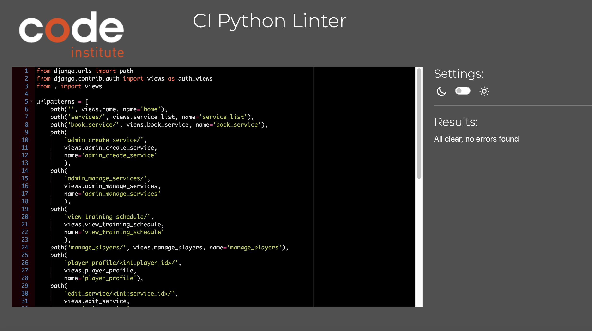
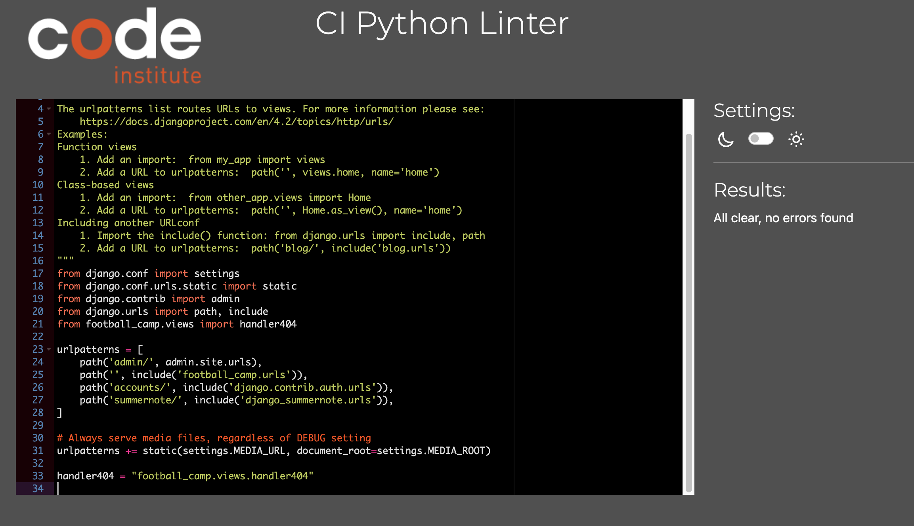
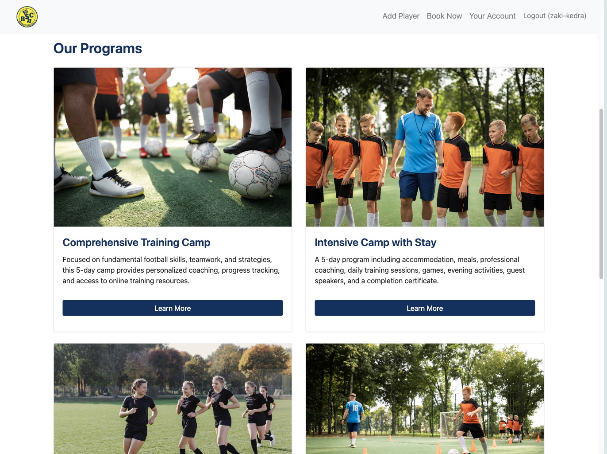
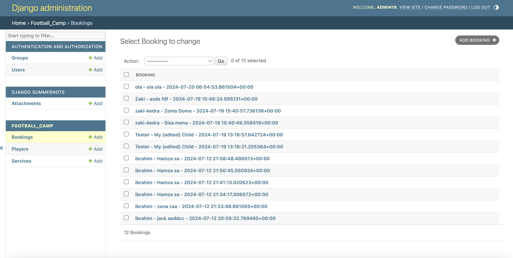
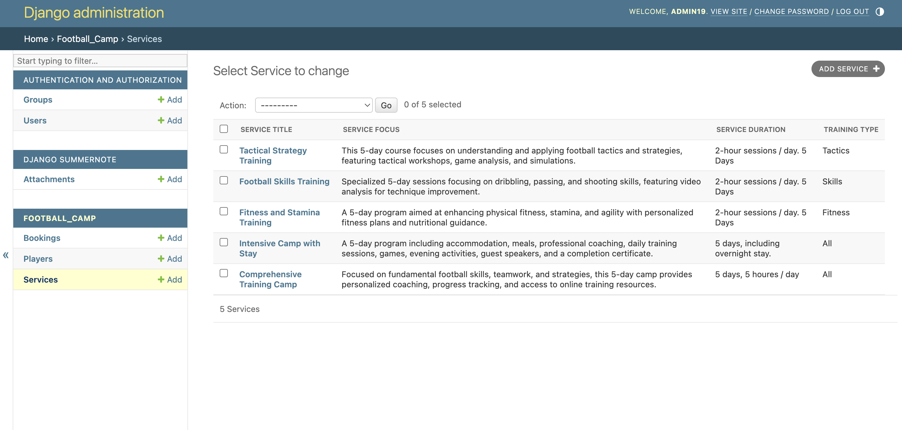
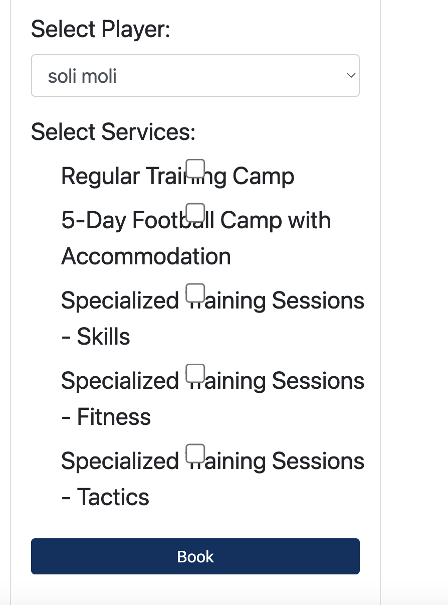

# Testing

> [!NOTE]  
> Return back to the [README.md](README.md) file.

## Code Validation

### HTML

I have used the recommended [HTML W3C Validator](https://validator.w3.org) to validate all of my HTML files.

| Directory | File | Screenshot | Notes |
| --- | --- | --- | --- |
| football_camp | home.html |  | |
| football_camp | book_service.html |  | |
| football_camp | confirm_delete_booking.html |  | |
| football_camp | confirm_delete_player.html |  | |
| football_camp | edit_booking.html |  | |
| football_camp | edit_player.html |  | |
| football_camp | manage_players.html |  | |
| football_camp | player_profile.html |  | |
| football_camp | service_page.html |  | |
| football_camp | user_account.html |  | |
| football_camp | login.html |  | |
| football_camp | register.html |  | |

### CSS

I have used the recommended [CSS Jigsaw Validator](https://jigsaw.w3.org/css-validator) to validate all of my CSS files.

| Directory | File | Screenshot | Notes |
| --- | --- | --- | --- |
| football_camp | style.css |  | |

### JavaScript

I have used the recommended [JShint Validator](https://jshint.com) to validate all of my JS files.

| Directory | File | Screenshot | Notes |
| --- | --- | --- | --- |
| football_camp | script.js |  | |

### Python

I have used the recommended [PEP8 CI Python Linter](https://pep8ci.herokuapp.com) to validate all of my Python files.

| Directory | File | CI URL | Screenshot | Notes |
| --- | --- | --- | --- | --- |
| football_camp | admin.py | [PEP8 CI](https://pep8ci.herokuapp.com/https://raw.githubusercontent.com/ibra8080/BSC-Hastedt-football-camp/main/football_camp/admin.py) |  | |
| football_camp | forms.py | [PEP8 CI](https://pep8ci.herokuapp.com/https://raw.githubusercontent.com/ibra8080/BSC-Hastedt-football-camp/main/football_camp/forms.py) |  | |
| football_camp | models.py | [PEP8 CI](https://pep8ci.herokuapp.com/https://raw.githubusercontent.com/ibra8080/BSC-Hastedt-football-camp/main/football_camp/models.py) |  | |
| football_camp | urls.py | [PEP8 CI](https://pep8ci.herokuapp.com/https://raw.githubusercontent.com/ibra8080/BSC-Hastedt-football-camp/main/football_camp/urls.py) |  | |
| football_camp | views.py | [PEP8 CI](https://pep8ci.herokuapp.com/https://raw.githubusercontent.com/ibra8080/BSC-Hastedt-football-camp/main/football_camp/views.py) |  | |
|  | manage.py | [PEP8 CI](https://pep8ci.herokuapp.com/https://raw.githubusercontent.com/ibra8080/BSC-Hastedt-football-camp/main/manage.py) |  | |
| my_project | settings.py | [PEP8 CI](https://pep8ci.herokuapp.com/https://raw.githubusercontent.com/ibra8080/BSC-Hastedt-football-camp/main/my_project/settings.py) |  | |
| my_project | urls.py | [PEP8 CI](https://pep8ci.herokuapp.com/https://raw.githubusercontent.com/ibra8080/BSC-Hastedt-football-camp/main/my_project/urls.py) |  | |

## Browser Compatibility

I've tested my deployed project on multiple browsers to check for compatibility issues.

| Browser | Home | Book Service | Your Account | Notes |
| --- | --- | --- | --- | --- |
| Chrome |  |  | | Works as expected |
| Firefox |  |   |  | Works as expected |
| Safari |  |  |  | Minor CSS differences |

## Responsiveness

I've tested my deployed project on multiple devices to check for responsiveness issues.

| Device | Home | Service | Book Service | User Account | Notes |
| --- | --- | --- | --- | --- | --- |
| Mobile (DevTools) |  |  |  |  | Works as expected |
| Tablet (DevTools) |  |  |  |  | Works as expected |
| Desktop |  |  |  |  | Works as expected |

## Lighthouse Audit

I've tested my deployed project using the Lighthouse Audit tool to check for any major issues.

| Page | Mobile | Desktop | Notes |
| --- | --- | --- | --- |
| Home |  |  | Slow response time due to large images |
| Service |  |  | Some minor warnings |
| Add player |  |  | Some minor warnings |
| Book Service |  |  | Some minor warnings |

## Defensive Programming

Defensive programming was manually tested with the below user acceptance testing:

| Page | Expectation | Test | Result | Fix | Screenshot |
| --- | --- | --- | --- | --- | --- |
| Home | | | | | |
| | Feature is expected to show a custom 404 page when a non-existent URL is accessed | Accessed a non-existent URL on the website | The custom 404 page was displayed as expected | Test concluded and passed |  |
| Register  | | | | | |
| | Feature is expected to prevent empty submission | Submitted an empty form | Form errors displayed for all fields: username, email, password | Test concluded and passed |  |
| | Feature is expected to prevent invalid email submission | Submitted a form with an invalid email | Form error displayed for the email field | Test concluded and passed |  |
| Add Player | | | | | |
| | Feature is expected to prevent empty submission | Submitted an empty form | Form errors displayed for all fields | Test concluded and passed |  |
| | Feature is expected to do prevent process when the player age isn’t between 8 and 15 | Tested the feature by input outrange age  | Error message displayed | Test concluded and passed |  |
| Edit player | | | | | |
| | Feature is expected to deny access when a user tries to edit a player belonging to another user | Attempted to edit a player belonging to another user | Displayed "Access Denied: You don't have permission to edit this player." and returned to home | Test concluded and passed |  |

## User Story Testing

| User Story | Screenshot |
| --- | --- |
| As a parent, I can view available football training services so that I can choose one that fits my needs.|  |
| As a parent, I can create an account so that I can manage my children for the football camp.|  |
| As a parent, I can log in so that I can access my account and manage my profile. |  |
| As an admin, I can view all bookings so that I can manage and oversee the booking system efficiently. |  |
| As an admin, I can view all players so that I can monitor and manage the registrations of all users. |  |
| As a Admin I can edit or delete existing services so that I can update the offerings as needed. |  |
| As a admin I can create new services so that I can offer various training options to the children. |  |
| As a parent, I can book services for my children so that they can attend training sessions and camps. |  |
| As a parent, I can add and manage player profiles so that I can register multiple children. |  |

## Bugs

- Django `DoesNotExist` at /book_service/ when trying to query a player**

    

    - To fix this, I ensured that the query to fetch the player was correctly written and verified that the player exists in the database before attempting to fetch it. Specifically, I added error handling for the `DoesNotExist` exception to provide a more user-friendly message or redirect the user to a relevant page if the player does not exist.

- Django **`TypeError` at /admin_create_service/ when trying to create a service**

    

    - To fix this, I checked the `Service` model definition to ensure that the field `name` exists and is correctly defined. I found that the `Service` model did not have a field named `name`. Therefore, I either corrected the field name in the model definition to match the expected keyword argument or updated the keyword argument in the view to match the actual field name in the `Service` model.

- Django `TemplateDoesNotExist` at /register/ when trying to load template

    

    - To fix this, I ensured that the `registration/register.html` template exists in the correct directory. I verified the template path and created the missing template file in the `templates/registration/` directory if it was not already present. Additionally, I checked the `TEMPLATES` setting in `settings.py` to ensure it includes the correct directories.### GitHub.

- Django `Improper HTML rendering` at homepage when trying to display programs

    

    - To fix this, I updated my template elements to include the `|safe` filter in Django to ensure that the HTML content is rendered correctly without escaping the HTML tags. This allowed the content to display as intended with the appropriate formatting and styling.

- Django `AttributeError` at /register/ when trying to access the profile attribute of a User object

    

    - To fix this, I ensured that the `User` model has a related `Profile` model using a OneToOneField relationship. I verified that the `Profile` object is created whenever a `User` object is created. Additionally, I checked if the `User` object is being correctly referenced and accessed in the view or form where the error occurred.

- CSS `Improper checkbox rendering` for selecting services

    

    - To fix this, I updated the CSS to ensure proper alignment and styling of the checkboxes and their labels. I added styles to adjust the margin, padding, and font size for better readability and visual appeal.

- Django `NameError` at /edit_booking/ when trying to access a URL that isn't mine

    

    - To fix this, I imported `HttpResponseForbidden` in the `views.py` file and added a `django.messages.error` for user feedback.

## Unfixed Bugs
> [!NOTE]  
> There are no remaining bugs that I am aware of.
